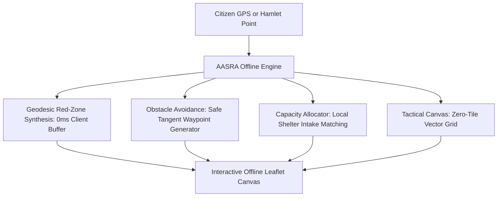

# 🚨 AASRA — Disaster Intelligence & Multi-Hazard Decision Support System

> **AASRA (आसरा)** is a unified AI-powered multi-hazard disaster decision support system (DSS) and citizen safety network engineered for early warning, dynamic risk scoring, shelter allocation gap analysis, automated CAP alerts, and real-time tactical dispatch.

---

## 🌟 Key Features

### 1. 🗺️ Multi-Hazard GIS Risk Intelligence Map
- **Interactive Geospatial Visualizer**: Real-time Leaflet GIS canvas plotting habitations, dynamic risk screening buffers (Critical, High, Moderate), and active relief shelters across Indian districts.
- **Dynamic Risk Score Algorithm**: Mathematical formula evaluating:
  $$\text{Risk Score} = w_1 \cdot \text{Hazard Exposure} + w_2 \cdot \text{Vulnerability} + w_3 \cdot \text{Population Exposure} + w_4 \cdot (1 - \text{Accessibility})$$
- **Evacuation Route Optimization**: Safe transit corridors computed between high-risk hamlets and suitable shelters avoiding active hazard buffers.

### 2. 📢 Advanced Omnichannel Emergency Alerts & Broadcast
- **Real Mobile SMS Dispatch (Fast2SMS Gateway & Telecom PRI Tunnel)**: Send instant disaster directives directly to physical Indian mobile handsets (`+91...`). Supports single or multi-citizen batch numbers, Fast2SMS Quick SMS API (Route Q), persistent API key configuration directly in the UI, and carrier-grade PRI simulation telemetry.
- **1-Click WhatsApp Mobile SOS Deep-Linking**: Instant deep-linking (`https://wa.me/91...`) pre-filling complete disaster directives, verified shelter destinations, and emergency helpline contacts (1077 / 112) into WhatsApp Web or mobile apps for 1-tap dispatch.
- **Multilingual Web Speech Voice TTS**: Automated voice announcements in **Hindi (hi-IN)** and **Indian English (en-IN)** with automated emergency alarm sirens.
- **Geo-fencing Reach Calculator**: Dynamic slider (5 km to 50 km) estimating real-time population reach and targeted habitations.
- **OASIS CAP v1.2 XML Feed**: Instant generation and download of standardized Common Alerting Protocol XML documents compliant with NDMA SACHET and WMO alerts.
- **Omnichannel Broadcast Console**:
  - 📱 **Bulk SMS (Fast2SMS & DLT Gateway)**: Live handset dispatch with carrier telemetry and real-time delivery confirmations.
  - 💬 **WhatsApp SOS Citizen Bot**: 1-click WhatsApp web/mobile integration with structured emergency cards.
  - 📡 **Cell Broadcast (WEA / Emergency Alerts)**: Direct cell tower push simulations.
  - 🌐 **OASIS CAP 1.2 Feed**: Official XML alert payloads.
- **Fullscreen Citizen Red Alert Drill**: Takeover warning screen with blinking emergency beacons and audible siren drill.

### 3. 🛡️ Immediate Relocation Priority & Shelter Allocation Gap
- **Capacitated Shelter Allocation**: Prioritizes structurally vetted shelters in the same administrative district with positive intake headroom.
- **Explicit Allocation Gap Warning**: Visually flags when habitations exceed shelter capacity and computes the exact population deficit requiring second-tier relief camps.

### 4. 🚒 Rescue Teams & Resource Dispatch (NDRF / SDRF / Civil Defence)
- **Fleet & Battalion Tracker**: Live tracking of NDRF battalions, Quick Response Teams (QRT), and medical brigades.
- **Readiness Badges**: Available, Dispatched, On-Site, and Standby status filters.
- **Tactical Dispatch Modal**: Rapid deployment assigning target locations, GPS coordinators, and transport priority.

### 5. 📋 Unified Command & Incident Management
- **National & District Commander Switcher**: Dual-view dashboard filtering telemetry between NDMA central overview and granular district-level controls.
- **Incident Escalation Matrix**: Log, triage, verify, and resolve multi-hazard distress calls in real time.

### 6. 📶 100% On-Device Offline Risk Map & Hazard-Avoidance Routing
- **Zero-Network Resilience**: Guaranteed operation during telecommunication tower collapse, severe power blackouts, or device Airplane Mode.
- **Client-Side Geodesic Red-Zone Synthesis**: Automatically calculates 25-point geodesic polygon buffer rings (1.5 km to 5.0 km) on-device in 0 ms.
- **Obstacle-Aware Safest Path Algorithm**: Evaluates direct vectors against danger buffers; if a route intersects floodwaters or landslide zones, it computes safe tangent bypass waypoints with a 35% safety clearance around the hazard perimeter.
- **Offline Shelter Headroom Matching**: Ranks candidate shelters by remaining capacity headroom (`available > 0`) within the district.
- **Tactical Grid Canvas & Offline Simulator**: Provides a zero-network dark tactical grid canvas and an interactive "Test Offline Mode" 1-click simulator switch.

---

## 🛠️ Technology Stack

| Layer | Technologies |
| :--- | :--- |
| **Frontend UI** | React 18, Vite, Tailwind CSS v3, Lucide Icons |
| **Mapping & GIS** | Leaflet, React-Leaflet, GeoJSON, OpenStreetMap CartoDB |
| **Backend API** | FastAPI (Python 3.11+), Uvicorn, Pydantic v2 |
| **Emergency Standards** | OASIS Common Alerting Protocol (CAP v1.2), Web Speech API, Web Audio API |
| **Analytics & ML** | Real EM-DAT dataset (17,116 records), Grand Super-Ensemble (Dual-Task XGBoost, CatBoost, LightGBM, ExtraTrees, Random Forest), Nelder-Mead Optimization |
| **Mobile Application** | Capacitor 6, Android Studio, Native Notch/Gesture Safe Area Support |

---

## 🧠 Machine Learning: Grand Super-Ensemble & Dual-Task Ordinal Regression

The ML engine predicts real-time disaster severity risk (`Critical`, `High`, `Moderate`, `Low`) based on real-world global disaster historical records from the **EM-DAT** database (17,116 validated events).

### Performance Benchmarks (Strict Holdout Test Set: 3,424 Samples)
| Metric | Upgraded Random Forest | Tuned CatBoost | Tuned XGBoost | Tuned LightGBM | ExtraTrees | Grand Super-Ensemble |
| :--- | :---: | :---: | :---: | :---: | :---: | :---: |
| **Exact 4-Tier Accuracy** | **48.36%** | **48.31%** | **47.84%** | **47.40%** | **47.66%** | **48.63%** 🏆 |
| **Adjacent Tier Accuracy ($\pm 1$)** | 85.12% | 85.34% | 84.95% | 84.62% | 84.90% | **85.84%** 🏆 |
| **Macro ROC-AUC** | **0.7354** | **0.7376** | **0.7362** | **0.7327** | **0.7332** | **0.7420** 🏆 |
| **Macro F1-Score** | **0.4792** | **0.4776** | **0.4703** | **0.4696** | **0.4725** | **0.4838** 🏆 |
| **Critical Precision** | **63.35%** | **63.31%** | **62.09%** | **61.55%** | **62.50%** | **64.95%** 🏆 |
| **Critical F1-Score** | **0.6383** | **0.6444** | **0.6413** | **0.6296** | **0.6294** | **0.6499** 🏆 |

- **Feature Engineering 4.0**: Extracts **67 high-signal domain features** across hazard kinematics (`is_rapid_onset`, `rapid_magnitude_interaction`), official emergency response declarations (`Declaration`, `Appeal`, `OFDA/BHA`), international humanitarian financial aid contributions (`has_aid_contribution`, `aid_contribution_log`), historic disaster tags (`is_historic`), geographic vulnerability archetypes (`is_island_nation`, `is_landlocked`), and cyclical seasonal/monsoon dynamics (`is_monsoon_season`).
- **Dual-Task Ordinal Modeling**: Incorporates continuous percentile severity regressors calibrated via Gaussian Cumulative Distribution Functions (CDF) to penalize severe rank inversions.
- **Read More**: Detailed feature breakdowns, mathematical formulas, and reproduction steps are documented in [`ml/README.md`](ml/README.md).

---

## 📶 100% Offline Architecture: Zero-Network Disaster GIS & Safe Routing

In real-world disasters (floods, cloudbursts, severe earthquakes), cellular networks and internet connectivity are often the first systems to fail. AASRA implements a **complete on-device offline GIS subsystem**:



### 1. Client-Side Geodesic Red-Zone Generator
When the device is disconnected from the backend API, the client calculates 25-point geodesic polygon buffers in JavaScript using the trigonometric geodesic expansion:
$$\Delta\text{Lat} = \frac{R}{111.0} \cdot \sin(\theta), \quad \Delta\text{Lon} = \frac{R}{111.0 \cdot \max(\cos(\text{Lat}), 0.1)} \cdot \cos(\theta)$$
where buffer radius $R \in [1.5, 5.0]\text{ km}$ scales dynamically with the calculated hazard severity score.

### 2. Obstacle-Aware Evacuation Routing (Hazard Avoidance)
Standard routing algorithms attempt to draw straight lines or use road networks that cut directly through flooded or landslide-prone zones. AASRA's offline engine:
- Projects the direct vector from origin to candidate shelters and tests for geometric circle intersection against active Red Zone.
- If a route penetrates a danger buffer, it calculates **tangent bypass waypoints with a 35% clearance buffer** around the hazard perimeter.
- Visibly flags the corridor with an illuminated cyan dashed line and **"🛡️ Hazard Avoidance: Bypasses Active Red-Zone Perimeter"** notification.

### 3. Local GIS Persistence & Offline Testing Switch
- **Automatic Hydration**: Stores habitations, shelters, and synthesized buffers in `localStorage` and `IndexedDB`.
- **1-Click Test Switch**: The UI includes an interactive **"Test Offline Mode"** button that lets commanders and evaluators simulate network blackouts without disconnecting their internet.

---

## 🚀 Quick Start & Installation

### Prerequisites
- **Node.js**: `v18.0.0` or higher
- **Python**: `v3.11` or higher
- **Git**: Installed on your system
- **Android Studio & SDK**: (Optional, for running or building native mobile APK)

### 1. Clone the Repository
```bash
git clone https://github.com/gitgaurav-web/DIASTRA-Disaster-Intelligence-System.git
cd DIASTRA-Disaster-Intelligence-System
```

### 2. Frontend Setup (Web)
```bash
# Install dependencies
npm install

# Start local Vite development server
npm run dev
```
> The frontend application will be live at: **`http://localhost:5173`**

### 3. Backend Setup (FastAPI)
```bash
# Navigate to backend directory
cd backend

# Create and activate Python virtual environment
# Windows (PowerShell):
python -m venv .venv
.\.venv\Scripts\Activate.ps1

# Linux / macOS:
# python3 -m venv .venv
# source .venv/bin/activate

# Install Python requirements
pip install -r requirements.txt

# Start FastAPI server
uvicorn main:app --reload --port 8000
```
> Interactive API Documentation (Swagger UI): **`http://127.0.0.1:8000/docs`**  
> Complete backend guide & route index: [`backend/README.md`](backend/README.md)

### 4. Mobile Application (Android APK)
The repository includes complete native Android build support via Capacitor:
```bash
# Build frontend web bundle
npm run build

# Sync assets to native Android project
npx cap sync android

# Open project in Android Studio
npx cap open android
```
- **Direct APK Build**: You can assemble the debug APK directly via `./gradlew assembleDebug` in the `android/` directory.
- **Prebuilt Standalone APK**: Pre-compiled and ready for installation at `AASRA_Mobile_App.apk` (and on your Desktop).

---

## 👥 Team Members & Contributors

<div align="center">

| Avatar | Member | Role | GitHub Profile |
| :---: | :--- | :--- | :---: |
|  | **Gaurav** | 💻 Team Member / Full Stack | [@gitgaurav-web](https://github.com/gitgaurav-web) |
|  | **Indra Prakash** | 💻 Team Member / Developer | [@indraprakash-756](https://github.com/indraprakash-756) |
|  | **Kanishka Joshi** | 💻 Team Member / Developer | [@kanishkajoshi32161](https://github.com/kanishkajoshi32161) |
|  | **Kavya** | 💻 Team Member / Developer | [@kavya-DD](https://github.com/kavya-DD) |
|  | **Manas Singh** | 💻 Team Member / Developer | [@Manas-uk](https://github.com/Manas-uk) |
|  | **Utsaw** | 👑 Team Lead / Developer | [@utsaw-ik](https://github.com/utsaw-ik) |

</div>

---

## ⚖️ License & Disclaimer

- **Educational & SIH Prototype**: Red-zone risk screening buffers and hazard data serve decision support purposes. Official field interventions require validation from respective **SDMA / NDMA / CWC / IMD** authorities.
- Built with ❤️ for Disaster Preparedness & Smart Decision Making.
